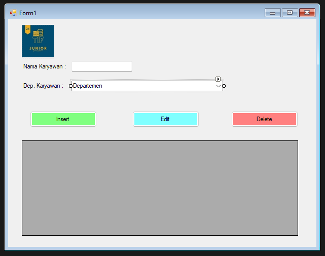
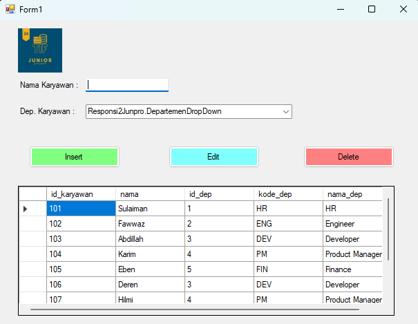
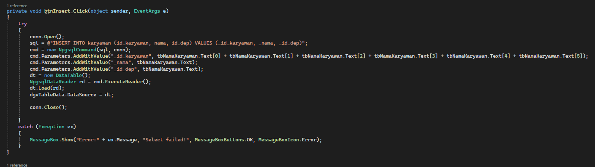
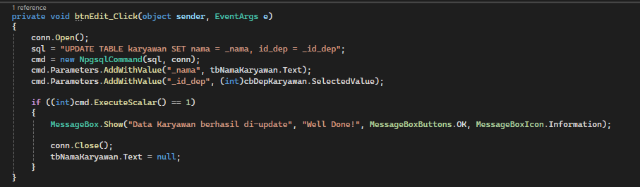
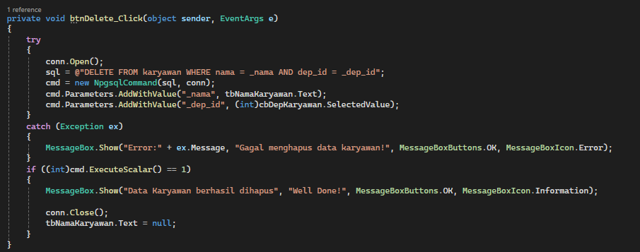
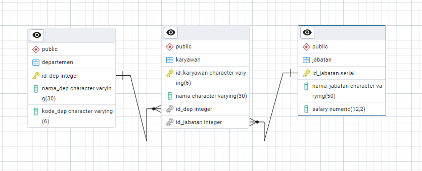
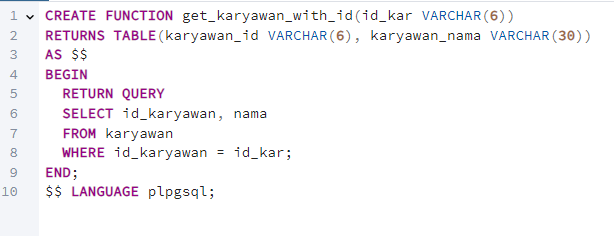
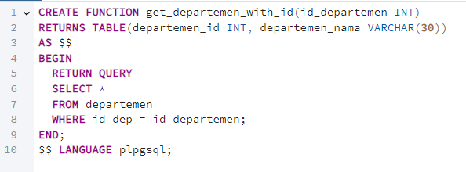

# Responsi 2 Junior Project
| No. | Nama | NIM |
|-----|----- |-----|
|1.   | Sulaiman Fawwaz Abdillah Karim| 22/493813/TK/54120 |

## Worksheet
Worksheet untuk responsi ini dapat diakses [di sini.](./assets/R2_493813_Sulaiman%20Fawwaz%20Abdillah%20Karim.pdf)

## Tampilan Interface Aplikasi Windows Forms
a. `Form1.cs [Design]`



b. Hasil Build



## Kode Tombol `Insert`, `Edit`, dan `Delete`
a. Tombol `Insert`


b. Tombol `Edit`


c. Tombol `Delete`


## Tugas Opsional
1. menambahkan table jabatan (id_jabatan, nama_jabatan, salary)


2. membuat fungsi di postgre (minimal 2 fungsi)
  * Fungsi `get_karyawan_with_id`
  ```SQL
  CREATE FUNCTION get_karyawan_with_id(id_kar VARCHAR(6))
  RETURNS TABLE(karyawan_id VARCHAR(6), karyawan_nama VARCHAR(30))
  AS $$
  BEGIN
    RETURN QUERY
    SELECT id_karyawan, nama
    FROM karyawan
    WHERE id_karyawan = id_kar;
  END;
  $$ LANGUAGE plpgsql;

  SELECT * FROM get_karyawan_with_id(1);
  ```
  

  * Fungsi `get_departemen_with_id`
  ```SQL
  CREATE FUNCTION get_departemen_with_id(id_departemen INT)
  RETURNS TABLE(departemen_id INT, departemen_nama VARCHAR(30))
  AS $$
  BEGIN
    RETURN QUERY
    SELECT * 
    FROM departemen
    WHERE id_dep = id_departemen;
  END;
  $$ LANGUAGE plpgsql;

  SELECT * FROM get_departemen_with_id(3);
  ```
  

3. menerapkan OOP (yang belum ditulis di soal) yaitu abstraksi dan polimorfisme